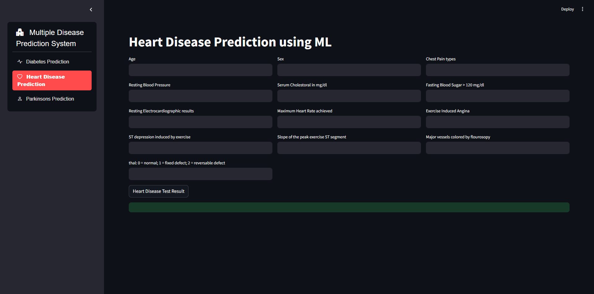
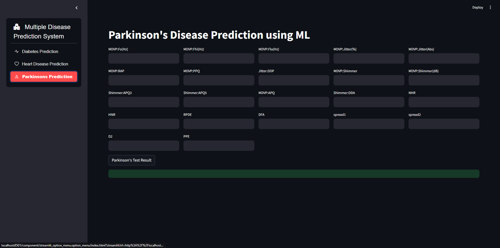
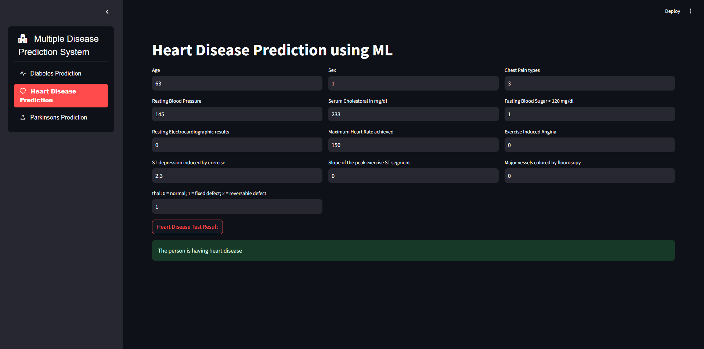
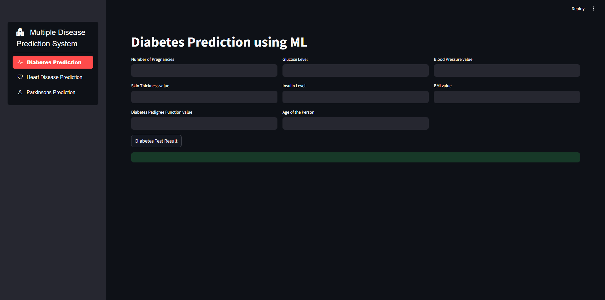

# Health Assistant - Multiple Disease Prediction Streamlit App 

## Project Overview

Health Assistant is a web application designed to predict the likelihood of diabetes, heart disease, and Parkinson's disease using machine learning models. The app provides an easy-to-use interface where users can input relevant medical data and receive instant predictions. This application leverages Streamlit for the frontend, and multiple pre-trained machine learning models for predictions.


## Features

- **Diabetes Prediction**: Input parameters like glucose level, blood pressure, BMI, etc., to predict the risk of diabetes.
- **Heart Disease Prediction**: Enter details such as age, cholesterol level, and chest pain type to assess the risk of heart disease.
- **Parkinson's Disease Prediction**: Provide voice measurements and other clinical features to predict the likelihood of Parkinson's disease.
- **User-Friendly Interface**: Clean and intuitive interface built with Streamlit.
- **Real-Time Predictions**: Get instant predictions as you input the required parameters.
- **Responsive Design**: Accessible from desktop, tablet, and mobile devices.

## Demo

To see the Health Assistant in action, click [here](https://health-assistant-byrafin.streamlit.app/) for a live demo.

## Screenshots
Below are some screenshots showcasing how the application works:

<div style="display: flex; gap: 10px; justify-content: center;">
    
    
</div>

<div style="display: flex; gap: 10px; justify-content: center;">
    
    
</div>

## Installation

Follow these steps to set up the Health Assistant locally:

1. **Clone the repository**:

   ```bash
   git clone https://github.com/zhrafin/health-assistant.git
   cd health-assistant
Create a virtual environment (optional but recommended):

```bash
  python -m venv venv
  source venv/bin/activate  # On Windows, use `venv\Scripts\activate`
```
  Install the required dependencies:

```bash
pip install -r requirements.txt
Run the application:
```

```bash
streamlit run app.py
Usage
```

## Predictions:

### Diabetes Prediction:
Navigate to the "Diabetes Prediction" section from the sidebar.
Enter the required medical data like number of pregnancies, glucose level, blood pressure, etc.
Click on the "Diabetes Test Result" button to get the prediction.


### Heart Disease Prediction:
Select the "Heart Disease Prediction" option from the sidebar.
Provide details such as age, sex, chest pain types, and other health parameters.
Click the "Heart Disease Test Result" button for the outcome.

### Parkinson's Prediction:
Go to the "Parkinsons Prediction" section.
Fill in voice measurements and other related parameters.
Hit the "Parkinson's Test Result" button to view the prediction.


## Technologies Used

 - Python: Programming language used for developing the application.
 - Streamlit: A framework for creating interactive web applications.
 - scikit-learn: Machine learning library used for model development.
 - pandas: Data manipulation and analysis.
 - pickle: For saving and loading the trained models


## Model Details

### 1. **Diabetes Prediction Model**

- **Algorithm**: Random Forest Classifier
- **Dataset**: The model is trained on the Pima Indians Diabetes dataset.
- **Accuracy**: 77%

### 2. **Heart Disease Prediction Model**

- **Algorithm**: Logistic Regression
- **Dataset**: The model is trained on the Cleveland Heart Disease dataset.
- - **Accuracy**: 82%

### 3. **Parkinson's Disease Prediction Model**

- **Algorithm**: XGBoost Classifier
- **Dataset**: The model is trained on the Parkinson's dataset from the UCI Machine Learning Repository.
- **Accuracy**: 72%


